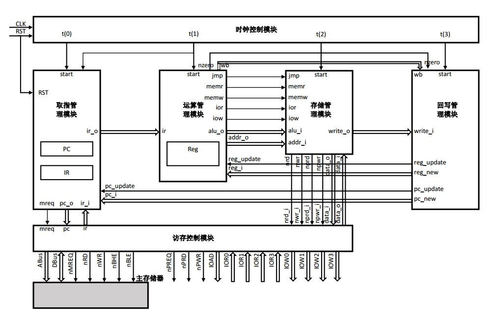

# 代码说明

> 哈尔滨工业大学《计算机设计与实践》2017年夏季CPU实验代码  

# 设计框图  
  

# 模块设计
* 时钟控制模块------------------------------clock.vhd  
* 取指管理模块------------------------------fetcher.vhd  
* 运算管理模块------------------------------alu.vhd  
* 存储管理模块------------------------------mem_manager.vhd  
* 回写管理模块------------------------------writebacker.vhd  
* 访存控制模块------------------------------mem_access.vhd  

---
详细设计参见《CPU设计报告》